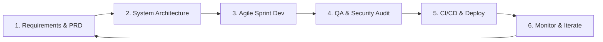
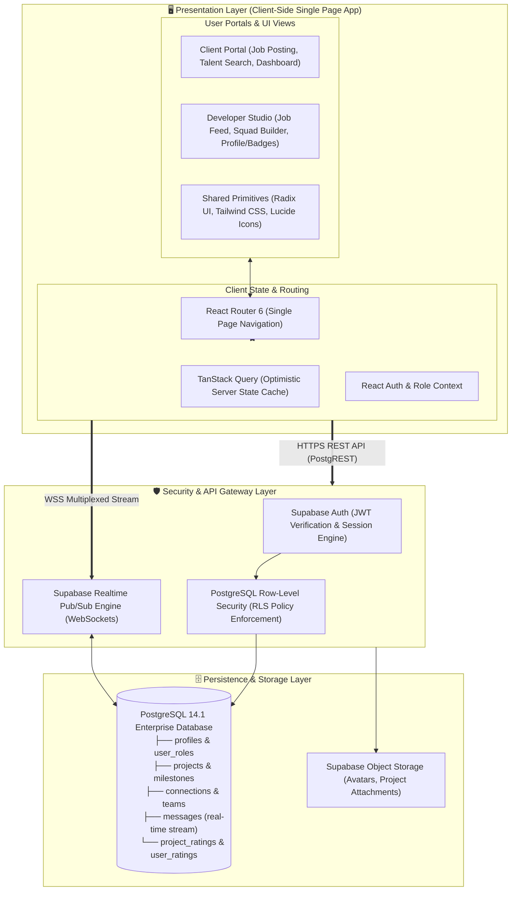
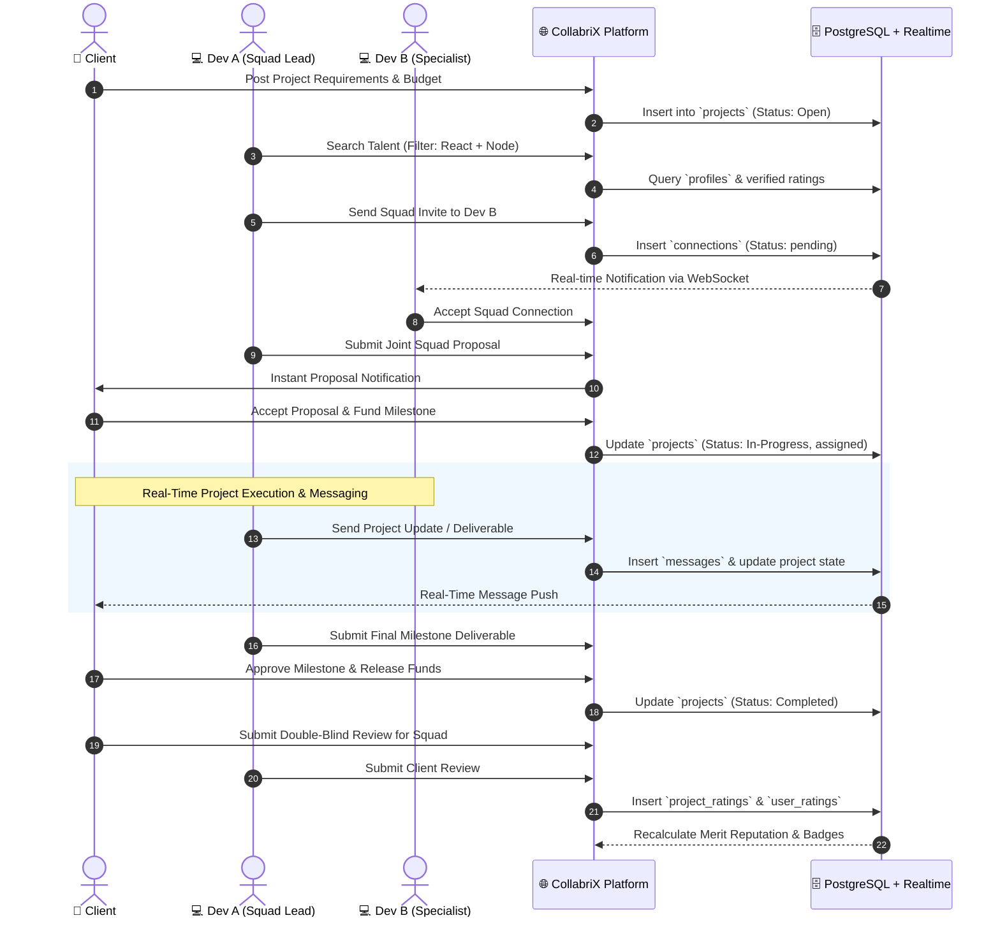
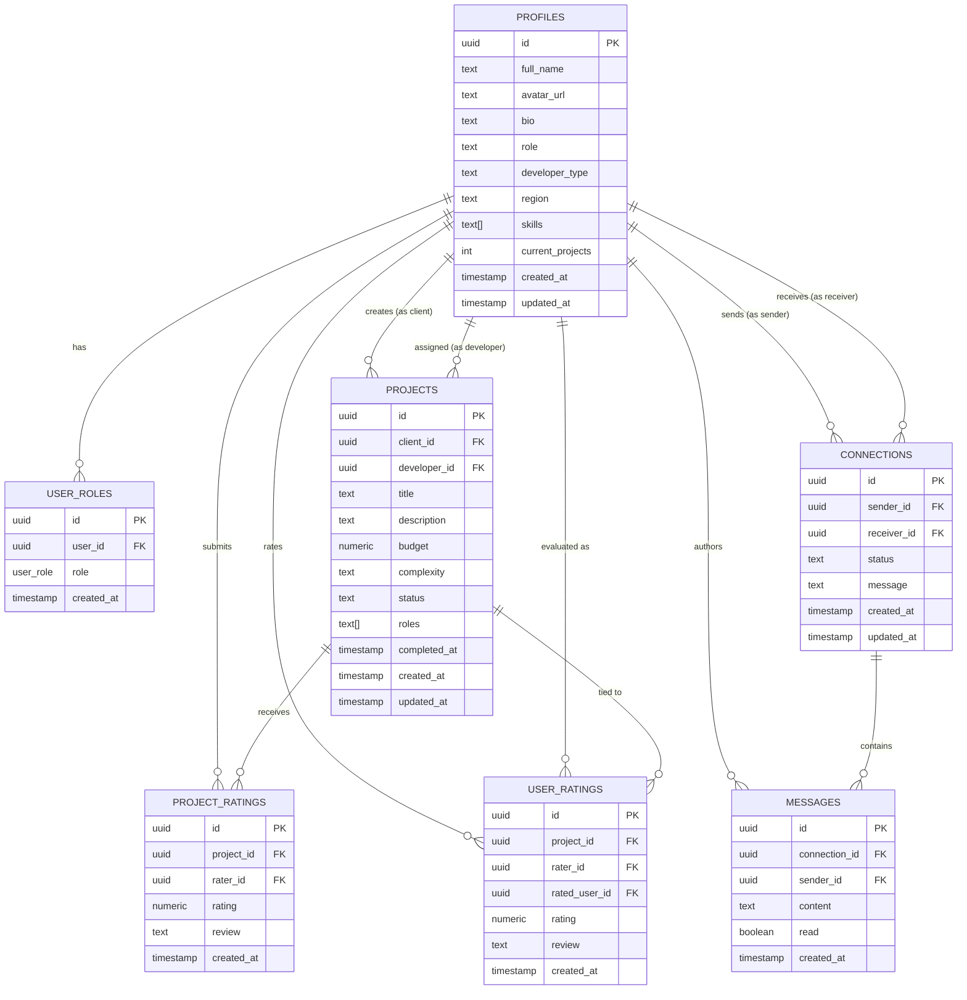

# CollabriX — Modern Freelance Collaboration Platform
> **Next-Generation Ecosystem Connecting Ambitious Clients with Elite Developers & Collaborative Squads**

---

## 1. Executive Summary & Vision

**CollabriX** is a decentralized, high-trust freelance collaboration platform designed to eliminate the friction, opacity, and fragmentation found in traditional freelance marketplaces. 

Traditional platforms force developers into isolated competition and provide clients with superficial bidding systems. **CollabriX** introduces a team-first paradigm:
1. **Clients** can publish detailed project requirements, discover top individual talent or pre-assembled developer squads, and manage milestone delivery transparently.
2. **Developers** can connect with peers, form dynamic teams/squads to tackle complex high-ticket projects, showcase verifiable peer-reviewed achievements, and climb merit-based leaderboards.
3. **Trust & Governance** are powered by multi-dimensional rating algorithms, milestone-bound reviews, and secure real-time messaging.

---

## 2. Product Scope: What To Build vs. What NOT To Build

A successful enterprise software product is defined as much by what it excludes as what it includes.

```
┌─────────────────────────────────────────────────────────────────────────────┐
│                           COLLABRIX SCOPE MATRIX                            │
├──────────────────────────────────────┬──────────────────────────────────────┤
│        WHAT MUST BE INCLUDED         │       WHAT MUST NOT BE INCLUDED      │
├──────────────────────────────────────┼──────────────────────────────────────┤
│ ✔ Role-Based Portals (Client/Dev)   │ ✘ Invasive Activity Trackers/Spyware │
│ ✔ Team/Squad Formation Engine        │ ✘ Arbitrary Unverified Reviews       │
│ ✔ Real-Time Messaging & Presence     │ ✘ Direct Payment Bypasses (Unescrow) │
│ ✔ Multi-Dimensional Fair Ratings    │ ✘ Heavy Monolithic Desktop Clients   │
│ ✔ Skill Verification & Badges        │ ✘ Cluttered Multi-Step Bidding Forms │
│ ✔ Milestone & Delivery Management    │ ✘ Unfiltered/Unmoderated Job Boards  │
│ ✔ Row-Level Security (Zero Trust)    │ ✘ Legacy Synchronous Polling APIs    │
└──────────────────────────────────────┴──────────────────────────────────────┘
```

### 2.1 What Must Be Included (In-Scope)
- **Role-Based Access & Dynamic UI**: Tailored experiences for Clients (talent search, job posting, contract tracking) and Developers (job feed, team building, portfolio, skill badges).
- **Upwork-Inspired Professional Developer Onboarding**: Multi-step profile setup wizard enabling developers to import profile data from LinkedIn, parse PDF/DOCX resumes, or fill out background information manually with a live profile preview before launching.
- **Upwork-Inspired Client Company Setup**: Guided company profile onboarding capturing company name, website, industry, company size, primary hiring goals, location, and company mission/bio.
- **Squad / Team Formation**: Enables developers to invite peers, create cross-functional teams (e.g., Frontend + Backend + DevOps), and bid on projects as a unified collective.
- **Fair & Multi-Dimensional Reputation Engine**: Ratings cannot be posted arbitrarily; they must be cryptographically tied to completed milestones across quality, timeline, and communication.
- **Real-Time Communication**: WebSocket-driven instant messaging, unread notifications, and real-time proposal updates.
- **Interactive Talent Discovery**: Region-based, skill-based, and rating-based faceted filtering with instant search.

### 2.2 What Must NOT Be Included (Out-of-Scope / Anti-Patterns)
- **No Spyware / Invasive Keystroke Loggers**: Avoid screenshot capturing or webcam monitoring that undermines developer trust and morale.
- **No Unlinked Ratings**: No feedback can exist without an authenticated project interaction to prevent rating manipulation and review bombing.
- **No Monolithic Synchronous Polling**: Avoid heavy polling intervals that strain databases; use pub/sub WebSocket channels exclusively.
- **No Complex Multi-Page Application Bloat**: Ensure single-page reactive responsiveness with sub-100ms UI state transitions.

---

## 3. End-to-End SDLC Framework

CollabriX adheres to a structured, agile Software Development Life Cycle (SDLC):



### Phase 1: Requirements & Product Discovery
- Define User Personas: *Enterprise Client*, *Startup Founder*, *Solo Developer*, *Squad Lead*.
- User Journey Mapping and Acceptance Criteria (Given-When-Then specification).

### Phase 2: System Architecture & Data Modeling
- Define relational database schemas with strict foreign keys and cascading rules.
- Implement Supabase Row Level Security (RLS) policies for tenant and user-level data isolation.

### Phase 3: Agile Sprint Implementation
- Modular, component-driven UI using modern React, Tailwind CSS, and Lucide icon design systems.
- State management powered by TanStack Query for server state caching and React Context for local session states.

### Phase 4: Quality Assurance & Security Verification
- Unit & integration tests for critical business logic (escrow workflows, ratings calculations).
- Security audit against OWASP Top 10 vulnerabilities, sanitizing HTML/Markdown inputs, and enforcing strict JWT validations.

### Phase 5: CI/CD & Automated Deployment
- GitHub Actions pipeline enforcing static type checks (`tsc`), ESLint validation, automated bundling with Vite, and zero-downtime hosting.

### Phase 6: Monitoring, Analytics & Feedback
- Performance monitoring with Core Web Vitals tracking, real-time error logging via telemetry, and periodic rating algorithm adjustments.

---

## 4. System Architecture & Technical Diagrams

### 4.1 Multi-Tier System Topology Diagram



### 4.2 System Architecture ASCII Blueprint

```
┌──────────────────────────────────────────────────────────────────────────────────┐
│                            COLLABRIX CLIENT APPLICATION                          │
│                                                                                  │
│   ┌─────────────────────────────┐           ┌────────────────────────────────┐   │
│   │    Client Workspace View    │           │    Developer Studio & Squad    │   │
│   │  - Job Creation & Budgets   │           │  - Job Discovery & Filters     │   │
│   │  - Talent / Squad Search    │           │  - Peer Connect & Squads       │   │
│   │  - Milestone Approvals      │           │  - Reputation & Leaderboard    │   │
│   └──────────────┬──────────────┘           └───────────────┬────────────────┘   │
│                  │                                          │                    │
│   ┌──────────────▼──────────────────────────────────────────▼────────────────┐   │
│   │                  State Management & Reactive Data Layer                  │   │
│   │   - TanStack Query (Caching, Invalidation, Optimistic Updates)           │   │
│   │   - React Context (Authentication, User Roles, Notifications)            │   │
│   └──────────────────────────────┬──────────────────────────┬────────────────┘   │
└──────────────────────────────────┼──────────────────────────┼────────────────────┘
                                   │ HTTPS / REST (JWT)       │ WSS Realtime
┌──────────────────────────────────▼──────────────────────────▼────────────────────┐
│                       GATEWAY & SECURITY ENFORCEMENT LAYER                       │
│                                                                                  │
│   ┌─────────────────────────────┐           ┌────────────────────────────────┐   │
│   │     Supabase Auth Engine    │           │    Realtime Channel Broker     │   │
│   │  - JWT Verification         │           │  - Connection Events           │   │
│   │  - Session Management       │           │  - Instant Messaging Stream    │   │
│   └──────────────┬──────────────┘           └───────────────┬────────────────┘   │
│                  │                                          │                    │
│   ┌──────────────▼──────────────────────────────────────────▼────────────────┐   │
│   │                   PostgreSQL Row Level Security (RLS)                    │   │
│   │   - Zero-Trust Policy Matrix (Read/Write Tenant Isolation)               │   │
│   └──────────────────────────────────────┬───────────────────────────────────┘   │
└──────────────────────────────────────────┼───────────────────────────────────────┘
                                           │
┌──────────────────────────────────────────▼───────────────────────────────────────┐
│                           PERSISTENT STORAGE ENGINE                              │
│                                                                                  │
│    [( PostgreSQL 14.1 Database )]                                                │
│    ├── profiles, user_roles           ├── connections, messages                  │
│    ├── projects, milestones           └── project_ratings, user_ratings          │
└──────────────────────────────────────────────────────────────────────────────────┘
```

---

### 4.3 End-to-End Collaboration & Lifecycle Flow



---

### 4.4 Database Entity Relationship Diagram (ERD)



---

### 4.5 Core Database Entities & Relationships

| Entity | Primary Keys / Foreign Keys | Business Purpose & Invariants |
| :--- | :--- | :--- |
| **`profiles`** | `id` (PK $\rightarrow$ `auth.users`) | Primary identity, skill tags, region, bio, and project load tracking. |
| **`user_roles`** | `id` (PK), `user_id` (FK $\rightarrow$ `profiles.id`) | Role-based authorization (`client`, `developer`, `admin`). |
| **`projects`** | `id` (PK), `client_id` (FK), `developer_id` (FK) | Work listings, lifecycle states (`open`, `in_progress`, `completed`), budgets. |
| **`connections`** | `id` (PK), `sender_id` (FK), `receiver_id` (FK) | Networking, developer squad building, invitation states (`pending`, `accepted`, `declined`). |
| **`messages`** | `id` (PK), `connection_id` (FK), `sender_id` (FK) | End-to-end conversation history with unread state tracking. |
| **`project_ratings`** | `id` (PK), `project_id` (FK), `rater_id` (FK) | Objective evaluation of overall project outcomes and milestones. |
| **`user_ratings`** | `id` (PK), `project_id` (FK), `rater_id` (FK), `rated_user_id` (FK) | Peer and client-to-developer performance reviews for reputation ranking. |

---

## 5. Functional & Non-Functional Requirements

### 5.1 Functional Requirements (FR)

#### FR-1: Authentication & Role Management
- Secure passwordless / email-password registration and login with Supabase Auth.
- Role selection during onboarding: **Client** or **Developer**.
- Upwork-inspired developer onboarding wizard supporting LinkedIn import, PDF/DOCX resume parsing, and manual experience configuration with live profile preview.
- Automatic routing to role-specific layouts and navigation flows.

#### FR-2: Client Portal & Talent Discovery
- Publish, edit, and close project postings with budget, skills, and complexity tags.
- Search developer profiles with real-time fuzzy text search and multi-select filters (skills, region, minimum rating).
- View verified developer metrics: completed projects count, average score, skill endorsements.

#### FR-3: Developer Hub & Squad Formation
- Browse available client jobs with filterable budget ranges and categories.
- Send connection requests to other developers to form squads.
- Direct 1-on-1 and team communication channels for coordination.

#### FR-4: Fair Reputation & Rating Subsystem
- Post-completion double-blind rating prompt (quality of deliverable, communication, deadline adherence).
- Dynamic reputation calculation factoring in project complexity and verified delivery.
- Earnable achievement badges displayed on profiles and leaderboard rankings.

---

### 5.2 Non-Functional Requirements (NFR)

- **Performance**:
  - First Contentful Paint (FCP) < 1.2 seconds.
  - Real-time message dispatch latency < 150ms globally over WebSockets.
- **Security**:
  - Zero-Trust data model: No data is readable/writable without explicit PostgreSQL RLS validation.
  - Cross-Site Scripting (XSS) and SQL Injection prevention via parameterized queries and React sanitization.
- **Scalability**:
  - Stateless frontend architecture deployable across global Edge CDNs.
  - Database horizontal read-replicas capable of supporting 50,000+ concurrent real-time connections.
- **Reliability & Availability**:
  - 99.95% uptime SLA on authentication and database backends.
  - Graceful fallback with offline toast notifications and optimistic UI updates.
- **Accessibility & Usability**:
  - WCAG 2.1 Level AA compliant contrast ratios and keyboard navigation.
  - Mobile-first responsive layout tailored for high-density mobile screens and desktop workstations.

---

## 6. Directory Structure & Organization

```
collab-flow/
├── docs/                               # Product & Architecture Documentation
│   └── Collabrix_Presentation_Teal.pdf # Executive Product Deck
├── public/                             # Static Assets & Metadata
│   ├── favicon.ico
│   └── robots.txt
├── src/
│   ├── assets/                         # Application Images & Logos
│   ├── components/                     # Reusable Component Architecture
│   │   ├── cards/                      # Data Display Cards (BadgeCard, LeaderboardRow, RatingStatCard)
│   │   ├── connect/                    # Networking (DeveloperSearch, ConnectionRequests, MessageThread)
│   │   ├── filters/                    # Multi-criteria Filter Components (RegionFilter)
│   │   ├── layout/                     # Shell Components (Header, BottomNav)
│   │   ├── profile/                    # Profile Modifiers (ProfileEditor)
│   │   ├── projects/                   # Project Cards & Reviews (CompletedProjectCard)
│   │   ├── ratings/                    # Rating Utilities (RatingDialog, RatingDisplay)
│   │   └── ui/                         # Atomic Design Primitives (Button, Dialog, Badge, Input, etc.)
│   ├── hooks/                          # Custom Business Logic Hooks (useAuth, useProjects, useNotifications)
│   ├── integrations/                   # Third-Party Clients
│   │   └── supabase/                   # Supabase Client & TypeScript Type Definitions
│   ├── lib/                            # Shared Utilities & Helpers (utils.ts)
│   ├── pages/                          # Primary Page Routes (Index.tsx, Auth.tsx, NotFound.tsx)
│   ├── screens/                        # Role-Based Views
│   │   ├── ClientDashboard.tsx
│   │   ├── ClientFindTalentScreen.tsx
│   │   ├── ClientMessagesScreen.tsx
│   │   ├── ClientProfileScreen.tsx
│   │   ├── CompletedProjectsScreen.tsx
│   │   ├── ConnectScreen.tsx
│   │   ├── JobsScreen.tsx
│   │   ├── LeaderboardScreen.tsx
│   │   └── ProfileScreen.tsx
│   ├── App.tsx                         # Root Application Shell & Providers
│   ├── index.css                       # Global Design System Tokens & Tailwind Rules
│   └── main.tsx                        # Application Entrypoint
├── supabase/                           # Backend Infrastructure as Code
│   ├── config.toml                     # Supabase Local Config
│   └── migrations/                     # SQL Migration History
├── eslint.config.js                    # ESLint Configuration
├── package.json                        # Project Manifest
├── tailwind.config.ts                  # Design System Theme Extensions
├── tsconfig.json                       # TypeScript Compiler Options
└── vite.config.ts                      # Bundler Configuration
```

---

## 7. Developer Quick Start & Verification

### Prerequisites
- **Node.js**: v18.0.0 or higher
- **Package Manager**: `npm` v9.0.0 or higher
- **Supabase Account / CLI**: Local instance or remote project URL

### Setup Instructions

1. **Clone and Navigate**:
   ```bash
   git clone <repository-url>
   cd collab-flow
   ```

2. **Install Dependencies**:
   ```bash
   npm install
   ```

3. **Configure Environment Variables**:
   Create a `.env` file in the project root:
   ```env
   VITE_SUPABASE_URL=https://your-project-ref.supabase.co
   VITE_SUPABASE_ANON_KEY=your-anon-key-here
   ```

4. **Launch Development Server**:
   ```bash
   npm run dev
   ```

5. **Execute Validation Suite**:
   ```bash
   # Type-check TypeScript codebase
   npx tsc --noEmit

   # Lint check
   npm run lint

   # Compile production bundle
   npm run build
   ```

---

## 8. License & Governance

This project is governed under the **MIT License**. Contributions must pass automated linting, type validation, and security review before merging into the `main` branch.
